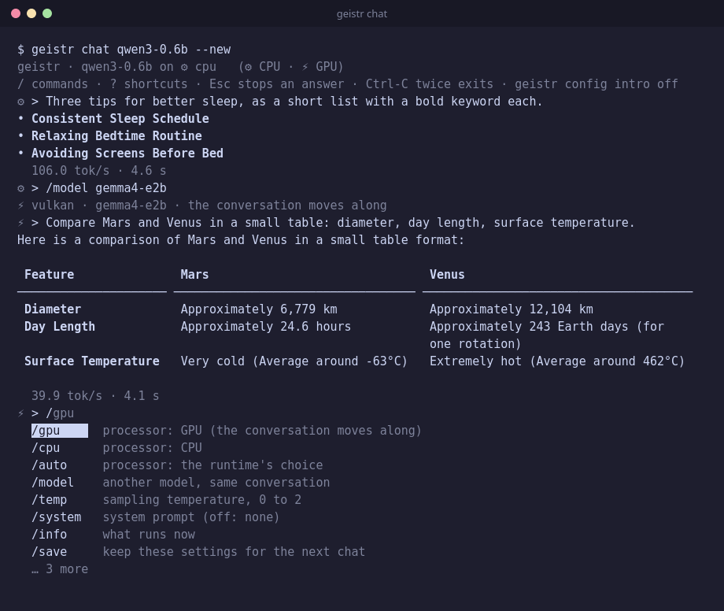

# geistr

Run language models on your own computer: download, chat, serve. One small
binary, no Python, no Docker, no account. The model runs locally, on the CPU
or the GPU.



## Install

```sh
curl -fsSL https://raw.githubusercontent.com/geisten/geist-runtime/main/install.sh | sh
```

Or with [Homebrew](https://brew.sh):

```sh
brew install geisten/tap/geistr
```

Both work on Linux (x86_64, arm64) and macOS (Apple Silicon). The script
downloads the latest release, checks it against `SHA256SUMS` and puts
`geistr` in `/usr/local/bin`.

Without sudo, or a specific release:

```sh
curl -fsSL https://raw.githubusercontent.com/geisten/geist-runtime/main/install.sh | PREFIX=~/.local sh
curl -fsSL https://raw.githubusercontent.com/geisten/geist-runtime/main/install.sh | GEISTR_VERSION=v0.1.1 sh
```

<details>
<summary>Requirements</summary>

The Linux binaries are fully static and run on any distribution. The CPU
needs x86-64-v3 (AVX2: Intel since 2013, AMD since 2015) or ARMv8.2 with
dotprod (Raspberry Pi 5, AWS Graviton 2 and newer); on an older CPU geistr
says so and exits. To build from source instead, see
[docs/DEVELOPMENT.md](docs/DEVELOPMENT.md#build-geistr-from-source).
</details>

## Quick start

```sh
geistr catalog                 # which models fit this computer
geistr pull qwen3-0.6b         # download and verify one (640 MB)
geistr chat qwen3-0.6b         # talk to it
```

Or a single answer, for scripts:

```sh
geistr run qwen3-0.6b "Name three prime numbers."
echo "Summarize: …" | geistr run qwen3-0.6b
```

## Models

`geistr catalog` lists the models geistr knows, marks what is installed (✓),
what is available (↓) and whether each fits your RAM (⚠/✗), with the speed
measured here on ⚙ CPU and ⚡ GPU.

| model | download | RAM |
|---|---|---|
| `smollm2-360m` | 0.4 GB | 2 GB |
| `qwen3-0.6b` | 0.6 GB | 4 GB |
| `qwen35-0.8b` | 0.8 GB | 4 GB |
| `bitnet-2b` | 1.2 GB | 4 GB |
| `gemma4-e2b` | 3.1 GB | 8 GB |
| `gemma4-e4b` | 5.0 GB | 16 GB |
| `bonsai2-27b-pq2` | 7.2 GB | 24 GB |
| `qwen38-27b-q4` | 16 GB | 32 GB |
| `qwen38-27b-q8` | 29 GB | 48 GB |

Every download is checked against its SHA-256 and resumes where it stopped.
Any other `.gguf` file works too: `geistr chat path/to/model.gguf`.

## Chat

In a terminal, `geistr chat` renders Markdown, tables and math, shows the
speed after each answer and continues your last conversation (see below).
Type `/` for the commands:

```
/model gemma4-e2b    switch the model, keep the conversation
/gpu /cpu /auto      switch the processor (Metal on macOS, Vulkan on Linux)
/temp 0.7            sampling temperature
/system Be brief.    system prompt (/system off removes it)
/info                what runs now
/save                keep model, processor, temperature and system prompt
/clear  /exit
```

| key | does |
|---|---|
| Esc | stop the answer |
| Ctrl-C | clear the line; twice on an empty line: exit |
| ↑ ↓ | earlier lines; → takes the hint |
| `?` | the shortcuts |

### Your conversation stays

Close the terminal, reboot, come back tomorrow: `geistr chat` picks up where
you left off, and the model still knows what you talked about.

```
↻ 6 · „Compare Mars and Venus in a small table…“ · /clear new
⚡ >
```

That is what makes a local model useful for real work: you can think a
problem through over several sessions, refer back to an earlier answer, or
switch to a bigger model mid-conversation without explaining everything
again. It is also private by design: each conversation is a plain file on
your computer (readable only by you, one JSON message per line), never sent
anywhere.

- `/clear` starts a new conversation and keeps the old file.
- `geistr chat --new` starts fresh once; `geistr config resume off` always.
- Piped chats (`echo … | geistr chat`) keep nothing, so scripts stay reproducible.

## Use it from other tools

Keep a model loaded and talk to it over the OpenAI or Ollama API, e.g. from
Open WebUI, editor plugins or the OpenAI SDK:

```sh
geistr serve gemma4-e2b --http          # http://127.0.0.1:11434
```

```sh
curl http://127.0.0.1:11434/v1/chat/completions \
  -d '{"messages":[{"role":"user","content":"Hi"}]}'
```

```python
from openai import OpenAI
client = OpenAI(base_url="http://127.0.0.1:11434/v1", api_key="unused")
reply = client.chat.completions.create(model="gemma4-e2b",
                                       messages=[{"role": "user", "content": "Hi"}])
print(reply.choices[0].message.content)
```

In Open WebUI, add `http://127.0.0.1:11434` as an Ollama connection (or
`…/v1` as OpenAI). Clients that resend the whole conversation pay only for
what is new.

<details>
<summary>Endpoints, the socket, and security</summary>

| endpoint | |
|---|---|
| `POST /v1/chat/completions` | OpenAI: `messages`, `temperature`, `max_tokens` / `max_completion_tokens`, `stop`, `stream` (SSE, `stream_options.include_usage`) |
| `GET /v1/models` | the one model |
| `POST /api/chat` | Ollama: `messages`, `stream` (NDJSON, default), `options.temperature`, `num_predict`, `stop` |
| `GET /api/tags`, `/api/version`, `/` | the model, the version, a health check |

There is no authentication. By default geistr listens on loopback only and
answers only requests addressed to this computer (`Host` check, against DNS
rebinding). `--http=0.0.0.0:11434` makes it reachable for everyone who can
reach the computer; geistr warns about that. Not supported: embeddings,
tool calls, images, more than one model. One request is answered at a time;
a client that disconnects stops its answer.

Without `--http`, `geistr serve` listens on a Unix socket only (owner only,
0600), and `geistr chat --socket` chats through it. `--chats N` sets how many
conversations the service keeps (default 2). The socket protocol is one
JSON object per line, documented in
[`tools/geistr/service.h`](tools/geistr/service.h):

```sh
echo '{"op":"chat","messages":[{"role":"user","content":"Hi"}]}' | nc -U ~/…/geistr.sock
```
</details>

## Settings

Settings are remembered between runs; `geistr config` shows them and the
file they live in.

```sh
geistr config processor gpu                # auto (default), cpu, gpu
geistr config temperature 0.7              # 0 to 2
geistr config system "Answer in German."   # system prompt for every new chat
geistr config markdown off                 # plain text
geistr config stats off                    # no speed line
geistr config resume off                   # always start new, keep nothing
```

`--cpu` / `--gpu` choose the processor for one run, `--models DIR` another
model folder.

<details>
<summary>All commands</summary>

| command | does |
|---|---|
| `geistr catalog [--installed \| --available] [--json]` | the models, their state, fit and speed |
| `geistr pull <id>` | download, resume, verify |
| `geistr pull` | update the installed models after a geistr update |
| `geistr run <model> [prompt…]` | one answer to stdout; the prompt from stdin if none |
| `geistr chat [<model>] [--new]` | interactive; without a model the last one |
| `geistr serve <model> [--http[=ADDR:PORT]] [--socket=PATH] [--chats N]` | the model as a service |
| `geistr chat --socket[=PATH]` | chat with that service |
| `geistr config [key [value]]` | settings |
| `geistr bench [model…]` | tokens/s on CPU and GPU (default: every installed model) |
| `geistr bench --compare [A [B]]` | two engine versions' speeds side by side |
| `geistr --version` | geistr, catalog revision, engine commit |

`<model>` is a catalog id or a path to a `.gguf` file. Options:
`--cpu` / `--gpu`, `--models DIR`, `--catalog FILE`. Exit codes: 0 ok,
1 error, 2 usage, 130 cancelled.

Every complete answer records its speed in `speed.tsv` in the data folder;
`geistr catalog` shows the median of the last ten.
</details>

## Update

`brew upgrade geistr`, or run the install command again. The model list
ships inside geistr, so new models come with a new geistr. Afterwards `geistr catalog` marks installed
models whose file changed with ⟳, and `geistr pull` fetches them (the old
file stays until the new one is verified).

## Python and C

geistr is built on **geist-runtime**, an embeddable model runner on
[geistlib](https://github.com/geisten/geistlib) with one C API
([`include/geistr.h`](include/geistr.h)) and a Python package:

```python
import geistr

with geistr.chat("gemma4-e2b", system="Answer briefly.") as chat:
    for piece in chat.send("What is the capital of France?"):   # streamed
        print(piece, end="", flush=True)
    print(chat.ask("And of Italy?"))           # only the new message is processed
```

Building, the library, tests and CI: [docs/DEVELOPMENT.md](docs/DEVELOPMENT.md).
API reference and design: [docs/API.md](docs/API.md).
